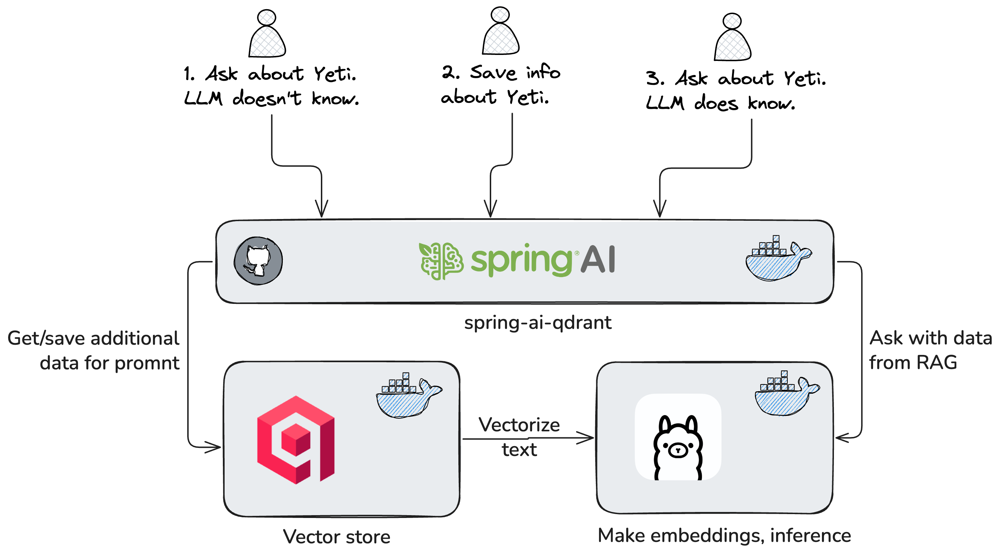

# 🚀 Spring AI + Qdrant

## 🛠 Technologies

- **Spring Boot 3.5.x** — Java microservices framework
- **Spring AI 1.x** — unified AI abstraction
- **Qdrant** — vector database for semantic search
- **Docker Compose** — for local AI & DB orchestration
- **JUnit 5** — unit & integration testing
- **Lombok** — concise Java code
- **Gradle (Kotlin DSL)** — build system

## 🏗 Architecture



## ⚡ Quick Start

1. **Start dependencies:**
   ```bash
   docker compose -f docker/docker-compose.yml up -d
   ```
   - Ollama: http://localhost:11434
   - Qdrant: http://localhost:6333
   - Qdrant Dashboard: http://localhost:6333/dashboard

2. **Build & run:**
   ```bash
   ./gradlew clean build
   ./gradlew bootRun
   ```

## 🔗 API

You can set `model: phi3` (default) or use a more powerful model, e.g. `deepseek-r1-distill-qwen-7b` for better quality.

- **POST /api/ai/chat** — Regular LLM chat
- **POST /api/ai/chat-rag** — Chat with RAG
- **POST /api/rag/save-text** — Save texts to vector DB
- **POST /api/rag/save-doc** — Index document (PDF/TXT/JSON)
- **POST /api/rag/search** — Search in vector DB
- **GET /api/rag/count** — Documents count

## 🧪 Testing

Unit & integration tests: `src/test/java`
```bash
./gradlew test
```
